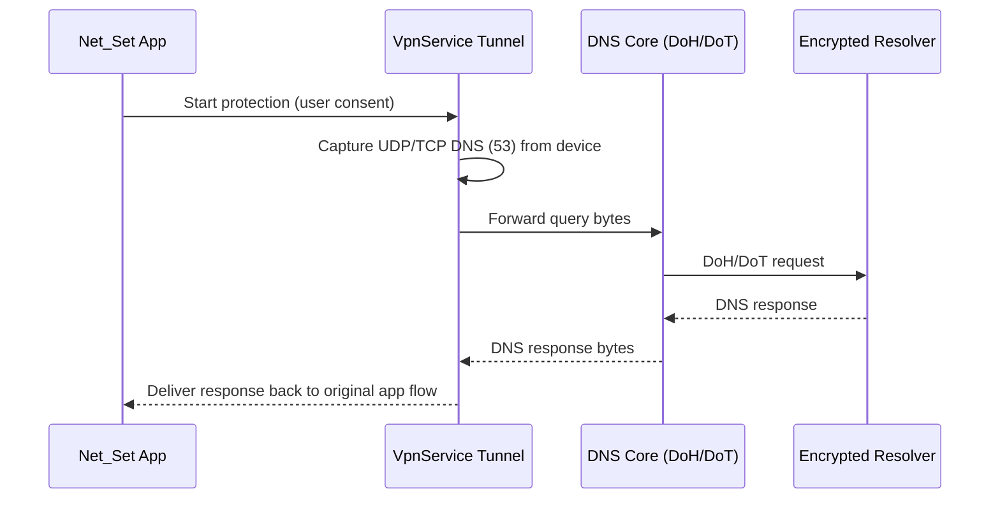

# Android Architecture & Technology Evaluation (Net_Set)

## 1) Context

Net_Set is currently a set of **Bash/PowerShell scripts** that harden network configuration and run diagnostics:

- IPv6 enablement + IPv6 security sysctls / preference tuning
- DNS encryption (Linux: DNS-over-TLS via `systemd-resolved`; Windows: DNS-over-HTTPS via DoH policy)
- “DHCP DNS isolation” (ignore DHCP-provided DNS and force secure resolvers)
- Firewall controls (Windows Firewall rules; Linux firewall knobs are referenced)
- Connectivity / censorship / speed checks

This document evaluates **native Android (Kotlin + Jetpack Compose)** vs **cross-platform (Flutter / React Native)** for an Android port and defines the recommended architecture.

### Default product assumption

**Assume the user does not have root.** The app must still meet the main goal: **enforce secure DNS and provide network verification**, using Android-supported workarounds.

In practice, that means the non-root “enforcement” path is based on **`VpnService`** (similar to NetGuard-style local VPN apps) rather than attempting to reconfigure global OS networking.

## 2) Constraints, assumptions, and target devices

### Constraints

- Android restricts global networking changes (DNS, routing, firewall, sysctl) to system apps or rooted devices.
- Background execution is heavily constrained (Doze/App Standby). Long-running enforcement requires a **foreground service**.
- “ICMP ping” is not reliable without privileged capabilities. Diagnostics must primarily use TCP/TLS/HTTP-based probes.

### Assumptions

- The app can ask the user to:
  - grant VPN consent (system prompt)
  - optionally set **Private DNS (DoT)** manually in system Settings
  - optionally enable “Always-on VPN” and “Block connections without VPN” for stronger enforcement

### Target API levels (proposal)

| Item | Value | Rationale |
|---|---:|---|
| `minSdk` | 26 (Android 8.0) | reasonable baseline; modern TLS, background limits are consistent |
| `targetSdk` | latest stable (currently 34/35 depending on build time) | Play requirements; modern permission model |
| “Best experience” | 29+ | better networking APIs, TLS providers, scoped storage defaults |

## 3) Capability mapping: scripts → Android

The table below maps each Net_Set capability to:
- **Android non-root path** (store-friendly default)
- **Root-only path** (optional “advanced mode”)
- **Unsupported areas** + fallback behavior

> Terminology: “device-wide” means affecting all apps. Without root, device-wide enforcement is only possible while the VPN is active.

### 3.1 Feature mapping table

| Capability in existing scripts | What it means on desktop | Android APIs (non-root default) | Root-only / privileged path | Unsupported / fallback |
|---|---|---|---|---|
| **IPv6 security** (enable IPv6, temp addrs, preference) | tweak sysctls (`/etc/sysctl.d`), `gai.conf` | **Observe + verify** using `ConnectivityManager`, `LinkProperties` (IPv6 addresses, DNS servers, routes). Prefer IPv6 when choosing test targets. In VPN mode, support IPv6 in the tunnel where possible. | root shell can attempt `/proc/sys/net/ipv6/*` writes; device/ROM dependent; not recommended as a core feature | Cannot reliably “enable IPv6” or set sysctls without root. Fallback: show IPv6 capability status + guidance; avoid breaking connectivity |
| **DNS over TLS / DoH** | `systemd-resolved` DoT; Windows DoH templates | **Primary**: intercept DNS inside `VpnService` and forward using **DoH/DoT** from app code. **Secondary**: deep-link user to Private DNS settings for OS-level DoT. | use root + `settings put global private_dns_*` (varies by Android version) to set Private DNS programmatically; still risky | Cannot programmatically change Private DNS in a store app. Fallback: VPN-based DNS enforcement and/or user instructions |
| **DHCP DNS isolation** | ignore DHCP-provided DNS; force secure resolvers | In VPN mode: ignore network-provided DNS and route all DNS to the selected encrypted resolver. Outside VPN: cannot override DHCP DNS globally. | root/privileged netd commands or system settings modifications (device-specific) | Fallback: “audit only” outside VPN; provide optional “Always-on VPN” guidance |
| **Firewall controls** | Windows Firewall rules, iptables concepts | Implement a **per-UID/per-destination firewall** inside the VPN tunnel: allow/deny by app UID, IP/CIDR, port, protocol; optional domain rules via DNS mapping. | iptables/nftables rules via root; OEM kernels differ; needs careful rollback | Fallback: VPN firewall for enforcement; outside VPN provide only diagnostics + recommendations |
| **Connectivity checks** (IPv4/IPv6/DNS/DoH/censorship) | ping, nslookup, curl, speedtest | Use `ConnectivityManager` + active network probes: TCP connect to known endpoints, HTTPS GET/HEAD, DoH query over HTTPS, DNS resolution via selected resolver. Measure latency via TCP/TLS handshake timing. | raw ICMP ping (`ping`), reading system resolver state, iptables counters | Fallback: avoid ICMP dependency; show “approximate ping” as TCP/TLS latency; expose methodology |
| **Backups / restore** | backup `/etc/*`, registry export | Store app settings only (DataStore). For root mode, optionally backup commands and a “restore” script to revert root-applied changes. | root: snapshot relevant files/props; OEM dependent | Fallback: in non-root mode, changes are mostly local to the VPN and reversible by stopping it |

### 3.2 What the Android version should *actually ship* (non-root)

- Encrypted DNS enforcement via **local VPN** (DoH/DoT)
- Optional VPN firewall rules (allow/deny by app)
- Network diagnostics dashboard (IPv4/IPv6 reachability, DNS tests, censorship heuristics, lightweight speed test)
- Clear “what we can/can’t change on Android” messaging

Root features should be strictly additive and should never be required to achieve the core goal.

## 4) Technology evaluation: Kotlin/Compose vs Flutter vs React Native

### Decision drivers (what matters for Net_Set Android)

1. **Deep integration** with Android networking: `VpnService`, `ConnectivityManager`, foreground services, WorkManager, per-UID accounting
2. **Performance** and reliability in a packet-processing loop (VPN tunnel)
3. **Security** (TLS, certificate handling, minimized attack surface)
4. **Long-term maintenance** and ability to ship Play-compliant builds

### Options

#### A) Native Kotlin + Jetpack Compose (recommended)

Pros:
- First-class access to Android APIs (VPN, services, notifications, WorkManager)
- Best performance and debugging story for VPN packet I/O (Kotlin + NIO; optionally drop to Rust/C++ later)
- Straightforward optional root integration (libsu) without complex bridging
- Compose is productive for a settings-heavy UI

Cons:
- Android-only (no immediate iOS parity)

#### B) Flutter

Pros:
- Great cross-platform UI iteration
- Strong ecosystem

Cons (for this project):
- VPN and low-level networking still require substantial platform-channel native code
- Two runtimes (Dart + JVM) increases complexity for a security-sensitive VPN core
- Harder to ensure packet-loop performance and avoid jank due to message passing

#### C) React Native

Pros:
- Cross-platform UI, large community

Cons (for this project):
- Bridging overhead and lifecycle complexity is a poor fit for always-on VPN + background work
- JavaScript runtime increases the attack surface for a security/network product
- High effort to maintain reliable native modules for VPN on diverse devices

### Final recommendation

**Build Net_Set Android as a native Android app using Kotlin + Jetpack Compose.**

Rationale: the core differentiator is network enforcement via `VpnService` + diagnostics, which is inherently platform-specific. Cross-platform UI frameworks do not remove the native complexity here; they mainly add an additional abstraction layer.

## 5) Proposed multi-layer architecture

### 5.1 Layers

1. **UI Layer (Compose)**
   - screens: status, DNS provider selection, firewall rules, diagnostics, logs, permissions/onboarding

2. **Domain Layer (use-cases)**
   - “Enable Protection”, “Run Diagnostics”, “Apply Firewall Rules”, “Export Report”

3. **Network Core (pure Kotlin)**
   - DoH/DoT client (OkHttp + TLS)
   - DNS message encoding/decoding
   - Probe engine (TCP/TLS/HTTP)
   - Rule engine (match UID/IP/port/domain)

4. **Platform Adapters**
   - **VPN adapter**: `VpnService` tunnel, DNS interception, socket protection
   - **System adapter**: `ConnectivityManager`, `NetworkCapabilities`, `LinkProperties`
   - **Root shell adapter (optional)**: libsu command executor, safe-guards + rollback

5. **Background Workers**
   - WorkManager periodic diagnostics (when allowed)
   - Foreground service for active VPN protection

### 5.2 Component diagram (Mermaid)

```mermaid
flowchart TB
  subgraph UI[UI - Jetpack Compose]
    Settings[Settings / Providers]
    Dashboard[Status Dashboard]
    Rules[Firewall Rules]
    Diagnostics[Diagnostics]
  end

  subgraph Domain[Domain Use-cases]
    Enable[EnableProtection]
    Verify[RunDiagnostics]
    ApplyRules[ApplyRules]
  end

  subgraph Core[Network Core (pure Kotlin)]
    DnsClient[DoH/DoT Client]
    Probes[Connectivity Probes]
    Engine[Policy/Rules Engine]
  end

  subgraph Platform[Platform Adapters]
    VPN[VpnService Adapter]
    Sys[Connectivity/System Adapter]
    Root[Root Shell Adapter (libsu, optional)]
  end

  subgraph BG[Background]
    WM[WorkManager Jobs]
    FGS[Foreground Service (VPN)]
  end

  UI --> Domain
  Domain --> Core
  Domain --> Platform
  VPN --> Core
  Sys --> Core
  Root --> Domain
  WM --> Domain
  FGS --> VPN
```

### 5.3 Data flow (DNS in VPN mode)



## 6) Permission model and compliance-driven design

### 6.1 Required permissions (non-root build)

| Purpose | Permission / mechanism | Notes |
|---|---|---|
| Network access | `INTERNET` | required |
| Network state | `ACCESS_NETWORK_STATE` | required for diagnostics |
| VPN | `VpnService` consent + `BIND_VPN_SERVICE` on the service declaration | user must explicitly approve |
| Foreground protection | `FOREGROUND_SERVICE` (+ appropriate FGS type depending on targetSdk) | VPN protection should run as FGS |
| Notifications | `POST_NOTIFICATIONS` (API 33+) | for VPN status + diagnostic alerts |
| Toggle Wi‑Fi / network (limited) | `CHANGE_NETWORK_STATE` | modern Android limits what can be changed; treat as best-effort |
| Per-app firewall UI (list installed apps) | Package visibility (`<queries>` in manifest) and, if needed, `QUERY_ALL_PACKAGES` | `QUERY_ALL_PACKAGES` requires Play policy justification; prefer manifest queries where feasible |

### 6.2 Permissions mentioned in the ticket (and feasibility)

- `MANAGE_TEST_NETWORKS`: **signature/privileged**; not available to third‑party Play Store apps. Use only in internal debug builds if ever needed.
- Root access: via **libsu** (optional). Root mode must be clearly labeled, disabled by default, and never required for core functionality.

## 7) Root vs non-root behavior matrix

| Feature / behavior | Non-root (default) | Root (optional advanced) |
|---|---|---|
| Enforce encrypted DNS for all apps | Yes, while VPN is active | Yes (VPN), plus possibly system-level settings depending on device |
| Enforce encrypted DNS without VPN | No | Sometimes (set Private DNS via `settings`; OEM dependent) |
| Isolate from DHCP DNS | Yes (VPN ignores it) | Yes (device-specific netd tweaks possible) |
| Firewall rules | Yes (VPN firewall) | Yes (VPN) + iptables/nftables possible |
| IPv6 sysctl hardening | No | Maybe (unsafe/fragile across devices) |
| ICMP ping | Not reliable | Usually possible |
| Works on stock Play devices | Yes | Root features not guaranteed; may conflict with Play policy depending on behavior |

## 8) Security, privacy, and store compliance

### Security principles

- Prefer **VPN-based enforcement** instead of attempting restricted system modifications.
- TLS must use modern defaults; never disable certificate validation.
- Treat DNS and traffic metadata as sensitive. Avoid collecting it unless the user explicitly enables local logging.
- Any “export report” feature must redact/omit personally identifying values by default (public IP, SSID, etc.).

### Privacy principles

- No third-party analytics by default.
- Diagnostics should be deterministic and minimal (small HTTP requests, clear destinations).
- If a resolver is configurable, clearly disclose that DNS queries will be sent to that provider.

### Play Store / policy considerations

- VPN apps must provide a clear disclosure of what traffic is handled and why.
- Avoid claims that imply guaranteed anonymity.
- Root-only features increase review risk; keep them optional and non-essential. Consider distributing “root/advanced” builds via a separate channel (e.g., GitHub releases) if needed.

## 9) Risks and explicit assumptions

### Key risks

1. **Device diversity**: VPN behavior, IPv6 support, and background limits vary across OEMs.
2. **Performance**: packet processing must be efficient to avoid battery drain and latency.
3. **Policy risk**: any behavior that resembles traffic interception must be clearly disclosed.
4. **DNS correctness**: implementing DNS proxying incorrectly can break captive portals and enterprise networks.

### Assumptions

- Users who want enforcement will accept enabling VPN (and optionally Always-on VPN).
- The app’s primary value is *secure DNS + verification*, not kernel-level sysctl tuning.

## 10) Suggested implementation sequence (next tickets)

1. **Create Android project + module split** (app, core, vpn, root-optional)
2. **Diagnostics MVP** (no VPN):
   - network status screen
   - IPv4/IPv6 reachability probes
   - DoH query test to Cloudflare/Quad9
3. **VPN MVP (pass-through)**:
   - establish `VpnService`, route traffic
   - implement DNS interception + DoH forwarding
4. **Rule engine + firewall UI**:
   - app allow/deny list by UID
   - basic IP/port rules
5. **Background & UX hardening**:
   - foreground notification
   - WorkManager periodic “verify” jobs
   - export/share a diagnostic report
6. **Optional root adapter**:
   - detect root, integrate libsu
   - only safe, reversible actions (avoid fragile sysctl changes)
7. **Security review & compliance**:
   - privacy policy draft
   - threat model and logging defaults audit

---

## Appendix: “Android equivalents” quick reference

- Network state: `ConnectivityManager`, `NetworkCapabilities`, `LinkProperties`
- DNS resolution (audit): `DnsResolver` (API 29+), `LinkProperties.getDnsServers()`, `InetAddress`
- VPN enforcement: `VpnService` + tun interface
- Background periodic work: WorkManager
- Long-running protection: Foreground service + notification
- App inventory for firewall UI: package visibility (`<queries>`), `PackageManager`
- Root execution (optional): libsu (`com.topjohnwu.superuser`)
