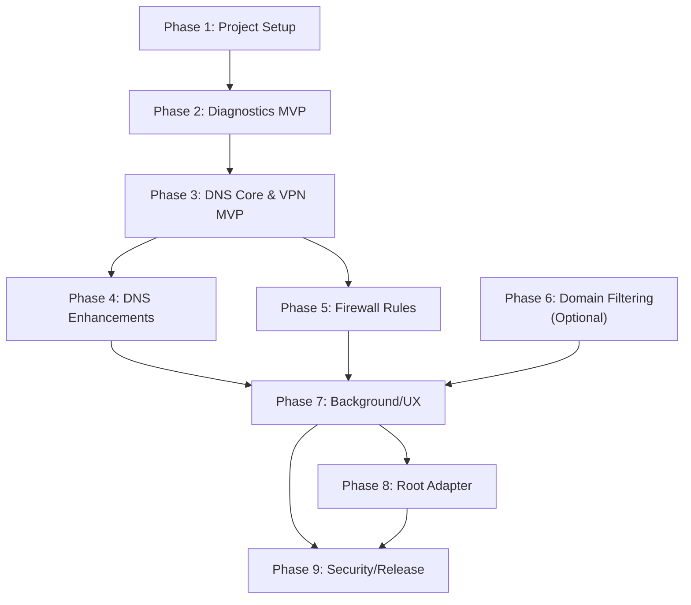

# Net_Set Android - Implementation Plan

## Executive Summary

This document provides a comprehensive, phase-by-phase roadmap for implementing **Net_Set for Android** as a native Kotlin + Jetpack Compose application. The plan translates the architectural decisions from [ANDROID_ARCHITECTURE.md](./ANDROID_ARCHITECTURE.md) into actionable phases with clear objectives, deliverables, dependencies, and exit criteria.

**Core Commitment**: The application enforces secure DNS (DoH/DoT) and provides network diagnostics on non-root devices via a VPN-based architecture. Root features are strictly optional, additive, and disabled by default.

---

## 1. Architecture Decision & Core Principles

### 1.1 Architecture Decision

**Technology Stack**: Native Kotlin + Jetpack Compose  
**Minimum SDK**: 26 (Android 8.0)  
**Target SDK**: 34+ (latest stable)  
**Recommended SDK**: 29+ (for best networking APIs and TLS support)

**Why Kotlin + Compose?**
- Direct access to `VpnService`, `ConnectivityManager`, foreground services, and WorkManager
- Superior performance for packet-processing loops in the VPN tunnel
- Clean security model with straightforward TLS configuration
- Optional root integration (libsu) without complex bridging overhead
- Productive UI development with Compose for settings-heavy interfaces

### 1.2 Core Principles

1. **Non-Root by Default**: All core functionality (DNS enforcement, diagnostics) works without root access
2. **VPN-Based Enforcement**: Secure DNS is enforced via a local VPN service while active
3. **User Consent & Transparency**: Clear disclosure of VPN behavior, DNS forwarding, and data handling
4. **No ICMP Dependency**: Diagnostics use TCP/TLS handshakes and HTTPS probes instead of ping
5. **Minimal, Safe Root Integration**: Root features are optional and never required; no fragile sysctl tuning
6. **Per-UID Firewall**: Optional per-app allow/deny rules within the VPN tunnel
7. **Store Compliance**: Architecture designed for Play Store approval with clear privacy policies

### 1.3 Key Constraints

- **Android API Restrictions**: Global DNS/routing/firewall changes require system apps or root
- **Background Limits**: Doze/App Standby require foreground services for always-on protection
- **ICMP Restrictions**: ICMP ping requires privileged capabilities; fallback to TCP/TLS latency measurement
- **Diverse OEMs**: VPN behavior, IPv6 support, and background limits vary widely across manufacturers
- **Play Store Policy**: VPN apps must disclose traffic handling; anonymity claims are forbidden

---

## 2. Deployment & Target Platforms

### 2.1 Device Matrix

| Aspect | Baseline | Recommended | Premium |
|--------|----------|-------------|---------|
| **Android Version** | 8.0 (API 26) | 10+ (API 29+) | 13+ (API 33+) |
| **VPN Support** | Full | Full | Full |
| **TLS/Modern Crypto** | Supported | Full support | Excellent |
| **Background Services** | Supported (Doze aware) | Strong | Excellent |
| **IPv6** | Observe only | Full support | Full support |
| **Networking APIs** | Limited | Good | Excellent |

### 2.2 Publishing Targets

| Platform | Status | Artifacts & Requirements |
|----------|--------|-------------------------|
| **Google Play Store** | Primary | APK; Privacy policy; Permissions disclosure; VPN consent UI |
| **F-Droid** | Supported | Source builds; no proprietary APIs (libsu optional); release notes |
| **GitHub Releases** | Community | APK + source; release notes; checksums; alt. root-enabled builds if separate |

### 2.3 Publishing Artifacts

- **Privacy Policy**: Disclose DNS forwarding, no analytics, optional local logging, data retention
- **App Store Listing**: Clear description of VPN behavior, DNS protection, and firewall features
- **Release Checklist**: Version bumping, git tagging, APK signing, Play Store upload, F-Droid metadata
- **Documentation**: In-app onboarding, FAQ, permissions explanation, restore instructions

---

## 3. Cross-Cutting Requirements & Mapping

The following requirements span multiple phases and are called out explicitly:

| Requirement | Context | Phases Introduced | Phases Enhanced |
|--|--|--|--|
| **Permissions (INTERNET, NETWORK_STATE)** | Basic network access | Phase 1 | All |
| **VPN Permission (BIND_VPN_SERVICE)** | VPN service binding | Phase 3 (VPN MVP) | All |
| **Foreground Service / Notification** | Always-on VPN protection | Phase 7 (Background/UX) | Phase 8, 9 |
| **Always-on VPN & Block Without VPN** | User-initiated enforcement | Phase 7 | Phase 8, 9 |
| **TCP/TLS Diagnostics (no ICMP)** | Core diagnostics methodology | Phase 2 (MVP) | Phases 4, 7 |
| **DoH/DoT Handling** | Encrypted DNS forwarding | Phase 3 (VPN MVP) | Phases 4, 5, 7 |
| **Per-UID Firewall** | App-level rules | Phase 5 (Rule Engine) | Phases 7, 8 |
| **Root Integration (libsu)** | Optional privileged mode | Phase 8 (Root Adapter) | Phase 9 |
| **Privacy & Data Redaction** | Compliance & trust | Phase 7 | Phase 9 |

---

## 4. Project Dependencies

### 4.1 Required Libraries & Versions

| Library | Purpose | Version Guidance | Phase Introduced |
|---------|---------|------------------|------------------|
| **OkHttp** | HTTP/HTTPS client for DoH, probes | `4.11.0+` | Phase 3 |
| **Compose BOM** | UI framework + dependencies | Latest stable | Phase 1 |
| **Kotlin Stdlib** | Language runtime | `1.9.0+` | Phase 1 |
| **AndroidX AppCompat** | Backward compatibility | Latest | Phase 1 |
| **AndroidX Lifecycle** | Lifecycle management | `2.6.0+` | Phase 1 |
| **AndroidX DataStore** | User preferences | `1.0.0+` | Phase 1 |
| **WorkManager** | Periodic background tasks | `2.8.0+` | Phase 7 |
| **libsu** | Root shell execution (optional) | `5.2.0+` | Phase 8 |
| **Retrofit** | REST API client (optional, if needed) | `2.9.0+` | Phase 4+ |
| **Hilt** | Dependency injection | Latest | Phase 4+ |

### 4.2 Gradle Build Configuration

```gradle
android {
    namespace = "com.net_set.android"
    compileSdk = 34
    
    defaultConfig {
        minSdk = 26
        targetSdk = 34
        versionCode = 1
        versionName = "0.1.0"
    }
}

dependencies {
    // UI & Compose
    implementation("androidx.compose.bom:...:2024.01.00")
    implementation("androidx.lifecycle:lifecycle-runtime-compose:...")
    
    // Network & DNS
    implementation("com.squareup.okhttp3:okhttp:4.11.0")
    implementation("com.squareup.okhttp3:logging-interceptor:4.11.0")
    
    // Background & Foreground
    implementation("androidx.work:work-runtime-kotlin:2.8.1")
    
    // Data persistence
    implementation("androidx.datastore:datastore-preferences:1.0.0")
    
    // Optional: Dependency Injection (Phase 4+)
    implementation("com.google.dagger:hilt-android:...")
    
    // Optional: Root integration (Phase 8+)
    implementation("com.topjohnwu.superuser:core:5.2.1")
}
```

---

## 5. Implementation Phases (1–9)

### Phase 1: Project Setup & Module Organization

**Objective**: Establish the multi-layer Android project structure, baseline Gradle configuration, and foundational dependencies.

**Duration**: ~2–3 weeks  
**Priority**: Critical (blockers for all subsequent phases)

#### Key Deliverables

1. **Module Structure**
   - `:app` – Main application, Activities, Composables, manifest
   - `:core` – Pure Kotlin networking logic (DNS, probes, rule engine)
   - `:vpn` – VPN service, packet I/O, DNS interception
   - `:platform-adapters` – System APIs (ConnectivityManager, VpnService, WorkManager)
   - `:root-adapter` (optional) – libsu integration for root commands

2. **Gradle Build System**
   - Multi-module gradle configuration with shared `build.gradle.kts`
   - Version catalogs for dependency management
   - Signing configuration for release builds
   - Flavor support for store (Play) vs. F-Droid vs. optional root builds

3. **Android Manifest & Permissions**
   - Declare `INTERNET`, `ACCESS_NETWORK_STATE`, `BIND_VPN_SERVICE`, `FOREGROUND_SERVICE`
   - Define VpnService + Foreground Service in manifest
   - Query filters for app enumeration (firewall UI)
   - Minimum targetSdk configuration

4. **Dependency Injection Framework** (Hilt)
   - AppComponent definition
   - ViewModelFactory setup
   - Repository patterns (if needed in Phase 1)

5. **Baseline Compose Setup**
   - Material Design 3 theme
   - Navigation infrastructure (Navigation Compose)
   - Base composables for settings, status screens

#### Involved Modules

| Layer | Content |
|-------|---------|
| **UI (Compose)** | App shell, navigation, theme, Material 3 baseline |
| **Domain** | Dependency injection, repository contracts |
| **Platform Adapters** | Manifest, permission declarations |
| **Background** | – (prepared but not yet active) |

#### Major Tasks

- [ ] Initialize Android Studio project with multi-module layout
- [ ] Create `:app`, `:core`, `:vpn`, `:platform-adapters` modules
- [ ] Set up `build.gradle.kts` with Compose BOM, Kotlin, AndroidX dependencies
- [ ] Add Hilt for DI; create AppComponent
- [ ] Design baseline Compose theme (Material 3)
- [ ] Implement Navigation Compose graph structure
- [ ] Update AndroidManifest.xml with required permissions & service declarations
- [ ] Add Gradle signing configuration for release builds
- [ ] Set up version catalogs and build variants

#### Dependencies

- **Incoming**: None
- **Outgoing**: All subsequent phases depend on this module structure

#### Exit Criteria

- ✅ Project builds without errors
- ✅ All modules are importable in Android Studio
- ✅ Manifest is valid (all required permissions declared)
- ✅ Hilt DI compiles and injects properly
- ✅ Navigation graph is defined and navigation previews work
- ✅ Material 3 theme compiles and applies to baseline Compose screens
- ✅ Gradle signing configuration is in place for release APKs

---

### Phase 2: Diagnostics MVP (No VPN)

**Objective**: Deliver a working diagnostics dashboard that measures network health without VPN protection. This provides immediate user value and validates the probe/measurement engine.

**Duration**: ~3–4 weeks  
**Priority**: High (core product value)

#### Key Deliverables

1. **Status Dashboard Screen**
   - Display current network interface (WiFi/Cellular)
   - Show IPv4 & IPv6 reachability status
   - Display connected DNS servers (system-provided)
   - Overall "network health" indicator

2. **Connectivity Probe Engine** (Network Core)
   - TCP connect probe to known endpoints (e.g., Google, Cloudflare)
   - HTTPS GET/HEAD request (latency measurement via TLS handshake)
   - IPv4 & IPv6 dual-stack testing
   - Per-protocol latency metrics
   - Graceful timeout & error handling

3. **DNS Resolver Testing**
   - DoH query to Cloudflare (`1.1.1.1/dns-query`)
   - DoH query to Quad9 (`9.9.9.9/dns-query`)
   - DNS resolution (A/AAAA records) via system resolver
   - Measure DNS response time
   - Test DNSSEC validation (if supported)

4. **Diagnostics Report UI**
   - Scrollable list of test results
   - Individual test status (pass/fail/warning)
   - Latency and response time display
   - Manual "Run Diagnostics" button
   - Progress indicator while tests run

5. **Async Execution & Error Handling**
   - Use Kotlin Coroutines for non-blocking probe execution
   - Timeout protection (e.g., 5s per probe)
   - Graceful fallback for network unavailability
   - User-friendly error messages

#### Involved Modules

| Layer | Content |
|-------|---------|
| **UI (Compose)** | Status screen, diagnostics screen, result display composables |
| **Domain** | RunDiagnostics use case, diagnostics repository interface |
| **Network Core** | TCP/HTTPS probe engine, DoH client, latency calculation |
| **Platform Adapters** | ConnectivityManager wrapper, network state listener |
| **Background** | – (deferred to Phase 7) |

#### Major Tasks

- [ ] Design Diagnostics domain use case with inputs/outputs
- [ ] Implement ConnectivityManager wrapper in platform-adapters
- [ ] Implement TCP connect probe in network core
- [ ] Implement HTTPS GET/HEAD probe with TLS latency measurement
- [ ] Implement DoH client for Cloudflare/Quad9 endpoints
- [ ] Implement DNS resolver testing via system APIs
- [ ] Create Status Dashboard Composable
- [ ] Create Diagnostics Screen with test list + results
- [ ] Add Coroutines + Flow for async probe execution
- [ ] Implement timeout + error handling
- [ ] Add unit tests for probe logic
- [ ] Verify on API 26, 29, 34 devices

#### Dependencies

- **Incoming**: Phase 1 (module structure, DI, Compose baseline)
- **Outgoing**: Phase 3 (DNS probes inform VPN tunnel configuration)

#### Exit Criteria

- ✅ Status dashboard renders network state (WiFi/Cellular/None)
- ✅ Manual diagnostics run without crashing
- ✅ TCP probes succeed to public endpoints (Google, Cloudflare)
- ✅ HTTPS probes measure TLS latency successfully
- ✅ DoH client successfully queries Cloudflare/Quad9
- ✅ Results display clearly with latency metrics
- ✅ Timeouts are enforced (no hanging probes)
- ✅ Error messages are clear and actionable
- ✅ Tests pass on emulator (API 26, 29, 34)

---

### Phase 3: DNS Core & VPN MVP (Pass-Through)

**Objective**: Implement the VPN service, DNS interception, and DNS-over-HTTPS/TLS forwarding. This is the foundation for secure DNS enforcement.

**Duration**: ~4–5 weeks  
**Priority**: Critical (core feature)

#### Key Deliverables

1. **VpnService Implementation** (Network Core + Platform Adapters)
   - Establish TUN interface via `VpnService`
   - Accept incoming connections from device
   - Establish and maintain VPN tunnel
   - Handle VPN lifecycle (start, stop, pause, resume)
   - Support IPv4 and IPv6 in the tunnel

2. **DNS Interception** (Network Core)
   - Capture UDP port 53 packets from device
   - Capture TCP port 53 packets from device
   - Parse DNS question/response using standard DNS library (e.g., `dnsjava` or pure Kotlin)
   - Route to encrypted resolver

3. **DoH/DoT Client** (Network Core)
   - OkHttp-based DoH client for Cloudflare, Quad9, NextDNS (configurable)
   - DoT (DNS-over-TLS) client as alternative
   - Certificate validation & TLS hardening
   - Query ID mapping & response correlation
   - Timeout & retry logic

4. **DNS Response Forwarding**
   - Convert DoH/DoT responses back to DNS wire format
   - Forward to original client (preserve port/IP)
   - Handle multi-answer/multi-question scenarios
   - Graceful failure (return SERVFAIL if upstream unreachable)

5. **VPN UI & Control**
   - "Enable Protection" button in main screen
   - Display VPN status (active/inactive)
   - Show active resolver (e.g., "Cloudflare 1.1.1.1")
   - "Disable Protection" / quick stop
   - Permission request dialog for VPN consent

6. **Socket Protection** (Platform Adapters)
   - Use `VpnService.protect()` to exclude DNS/resolver traffic from tunnel
   - Prevent routing loops

#### Involved Modules

| Layer | Content |
|-------|---------|
| **UI (Compose)** | VPN status indicator, Enable/Disable button, resolver selector |
| **Domain** | EnableProtection, DisableProtection use cases |
| **Network Core** | DNS parsing, DoH/DoT client, response forwarding |
| **VPN** | VpnService, TUN interface management, packet I/O |
| **Platform Adapters** | VpnService lifecycle, network protection |
| **Background** | – (deferred to Phase 7) |

#### Major Tasks

- [ ] Create VpnService class extending Android VpnService
- [ ] Implement TUN interface setup and packet loop
- [ ] Implement DNS packet parsing (questions/answers/flags)
- [ ] Implement DoH client using OkHttp for Cloudflare/Quad9
- [ ] Implement DoT client using OkHttp with TLS
- [ ] Implement DNS response serialization back to wire format
- [ ] Add socket protection to exclude VPN traffic from tunnel
- [ ] Create EnableProtection use case
- [ ] Create DisableProtection use case
- [ ] Add VPN status to Domain layer
- [ ] Update Status Screen with VPN status
- [ ] Create resolver selector UI (Cloudflare, Quad9, custom)
- [ ] Add VpnService to manifest with correct permissions
- [ ] Implement VPN permission request flow
- [ ] Add end-to-end integration tests (mock upstream)
- [ ] Test on device with real VPN traffic

#### Dependencies

- **Incoming**: Phase 1 (module structure), Phase 2 (diagnostics engine)
- **Outgoing**: Phase 4 (DNS caching, resolver selection), Phase 5 (firewall rules)

#### Exit Criteria

- ✅ VpnService starts and stops cleanly
- ✅ TUN interface is established and accepts packets
- ✅ DNS UDP port 53 packets are captured
- ✅ DNS TCP port 53 packets are captured
- ✅ DNS queries are forwarded to DoH endpoint successfully
- ✅ DNS responses are returned to original client
- ✅ Multiple resolvers (Cloudflare, Quad9) can be selected
- ✅ VPN permission dialog appears and user can grant consent
- ✅ Status screen shows VPN active/inactive correctly
- ✅ No routing loops (socket protection working)
- ✅ Tested on API 26, 29, 34 devices
- ✅ TLS certificate validation is enforced (no MITM possible)

---

### Phase 4: DNS Core Enhancements & Resolver Configuration

**Objective**: Deepen DNS handling with caching, response validation, and multi-resolver support. Prepare for Phase 5 (firewall rules).

**Duration**: ~2–3 weeks  
**Priority**: Medium (improves UX; optional but valuable)

#### Key Deliverables

1. **DNS Caching Layer** (Network Core)
   - In-memory DNS response cache (TTL-aware)
   - Reduce upstream queries for repeated names
   - Configurable cache size & eviction policy
   - Per-query caching decision (some queries should bypass cache)

2. **Response Validation** (Network Core)
   - Validate DNS response format (malformed packet detection)
   - Check response matches query (ID correlation)
   - Detect DNS spoofing attempts (unexpected responses)
   - Log/alert on validation failures

3. **Multi-Resolver Support** (Domain + Network Core)
   - Allow user to configure custom DoH endpoints
   - Support multiple concurrent resolvers (failover)
   - Per-domain resolver assignment (route queries by domain)
   - Import/export resolver lists (JSON configuration)

4. **Resolver UI** (UI - Compose)
   - Settings screen for resolver management
   - Built-in resolver options (Cloudflare, Quad9, NextDNS, custom)
   - Test resolver button (quick connectivity check)
   - Resolver details & DNSSEC support indicator

5. **DataStore Integration** (Platform Adapters)
   - Persist user resolver selection
   - Persist DNS cache settings
   - Persist per-domain rules (if enabled)

#### Involved Modules

| Layer | Content |
|-------|---------|
| **UI (Compose)** | Resolver selector, settings, test button |
| **Domain** | SelectResolver, TestResolver use cases |
| **Network Core** | DNS cache, response validation, multi-resolver routing |
| **Platform Adapters** | DataStore for settings persistence |
| **VPN** | Integrate multi-resolver into DNS forwarding |

#### Major Tasks

- [ ] Design DNS cache structure (TTL, max size)
- [ ] Implement DNS cache with LRU eviction
- [ ] Implement DNS response validation
- [ ] Design resolver configuration data structure
- [ ] Implement multi-resolver selection logic
- [ ] Create Resolver Settings Composable
- [ ] Implement TestResolver use case (quick test)
- [ ] Add DataStore schema for resolver configuration
- [ ] Integrate resolver selection into VPN DNS forwarding
- [ ] Add unit tests for caching, validation, resolver selection
- [ ] Test failover behavior when resolver is unavailable

#### Dependencies

- **Incoming**: Phase 3 (DNS core, VPN MVP)
- **Outgoing**: Phase 5 (firewall rules depend on stable DNS resolution)

#### Exit Criteria

- ✅ DNS responses are cached and subsequent queries are faster
- ✅ Cache respects TTL values
- ✅ Cached responses reduce upstream DoH queries
- ✅ Response validation detects malformed/spoofed packets
- ✅ User can select between Cloudflare, Quad9, and custom resolvers
- ✅ Resolver selection is persisted across app restarts
- ✅ Test resolver button works and provides feedback
- ✅ Failover works if primary resolver is unavailable
- ✅ Custom DoH endpoints can be configured and tested

---

### Phase 5: Rule Engine & Firewall UI

**Objective**: Implement per-app (per-UID) firewall rules within the VPN tunnel, allowing users to block/allow apps on a granular level.

**Duration**: ~3–4 weeks  
**Priority**: Medium (valuable feature; non-critical for MVP)

#### Key Deliverables

1. **Firewall Rule Engine** (Network Core)
   - Parse incoming packets for source UID (via `/proc/net/tcp` or eBPF if available)
   - Match packets against rule set (allow/deny by UID, IP, port, protocol)
   - Execute actions (pass through or drop)
   - Support domain-based rules (map domain to IP + block)
   - Log rule matches for diagnostics

2. **Rule Data Structure** (Domain)
   ```kotlin
   data class FirewallRule(
       val id: String,
       val uid: Int,         // app UID or -1 for system
       val action: Action,   // ALLOW, DENY, ISOLATE
       val ipCidrs: List<String>,  // e.g., ["10.0.0.0/8"]
       val ports: List<IntRange>,   // port ranges
       val protocol: Protocol,      // TCP, UDP, BOTH
       val domains: List<String>,   // optional domain matches
       val enabled: Boolean,
       val priority: Int            // rule evaluation order
   )
   ```

3. **App Inventory & UI** (UI - Compose + Platform Adapters)
   - List all installed apps (from PackageManager)
   - Display app icons, names, package names
   - Show per-app data usage (if available from ConnectivityManager)
   - Toggle allow/deny for each app
   - Search/filter by app name
   - Mark system apps separately

4. **Rule Editing UI** (UI - Compose)
   - Create new rule dialog
   - Edit existing rule (UID, action, IP ranges, ports)
   - Delete rule confirmation
   - Rule preview/testing

5. **Rule Persistence & DataStore** (Platform Adapters)
   - Store rules in DataStore as JSON
   - Import/export rule sets
   - Backup/restore rules

6. **VPN Integration** (VPN)
   - Integrate rule engine into packet forwarding
   - Check rules before allowing packets through VPN
   - Log matched rules for diagnostics

#### Involved Modules

| Layer | Content |
|-------|---------|
| **UI (Compose)** | App list, firewall rules screen, rule editor |
| **Domain** | ApplyFirewallRules, CreateRule, DeleteRule use cases |
| **Network Core** | Firewall rule engine, packet matching, rule evaluation |
| **VPN** | Integrate rule engine into packet loop |
| **Platform Adapters** | PackageManager for app inventory, DataStore for rule persistence |

#### Major Tasks

- [ ] Design firewall rule data structure
- [ ] Implement rule engine (match UID, IP, port, protocol)
- [ ] Implement app inventory fetching from PackageManager
- [ ] Create App List Composable with icons and toggle
- [ ] Create Rule Editor Composable
- [ ] Implement DataStore schema for rule persistence
- [ ] Implement rule import/export (JSON format)
- [ ] Integrate rule engine into VPN packet loop
- [ ] Add rule-matched logging
- [ ] Implement app search/filter
- [ ] Add unit tests for rule matching logic
- [ ] Test rule persistence across app restarts
- [ ] Test rule evaluation with mock packets

#### Dependencies

- **Incoming**: Phase 3 (VPN MVP), Phase 4 (DNS resolution)
- **Outgoing**: Phase 7 (background integration)

#### Exit Criteria

- ✅ App list renders all installed apps with icons
- ✅ User can enable/disable protection for individual apps
- ✅ Rules are persisted and survive app restart
- ✅ Firewall rules are evaluated for each packet
- ✅ Blocked packets are dropped; allowed packets pass through
- ✅ System apps can be distinguished and handled separately
- ✅ Rule matching is accurate (no false positives/negatives)
- ✅ Rules can be imported/exported as JSON
- ✅ Rule-matched events are logged for debugging

---

### Phase 6: Advanced Rule Types & Domain Filtering (Optional Enhancement)

**Objective**: Extend the rule engine with domain-based blocking and advanced matching criteria. This is optional but valuable for users who want granular control.

**Duration**: ~2–3 weeks  
**Priority**: Low (enhancement; can be deferred)

#### Key Deliverables

1. **Domain Whitelist/Blacklist** (Network Core)
   - Maintain a list of domains to block or allow
   - Intercept DNS queries and check against list
   - Respond with NXDOMAIN for blocked domains
   - Log domain-blocked events

2. **Domain Rule Management UI** (UI - Compose)
   - Add/remove domains from blocklist
   - Import domain lists from URLs (ads, trackers, etc.)
   - Preview domain list size and last update

3. **Advanced Rule Criteria** (Network Core)
   - Time-based rules (e.g., block certain apps during night)
   - Network-based rules (e.g., apply different rules on WiFi vs. cellular)
   - Certificate-pinning for sensitive apps (optional)

#### Dependencies

- **Incoming**: Phase 5 (firewall rules)
- **Outgoing**: Phase 7 (background integration)

#### Exit Criteria

- ✅ Domain lists can be configured
- ✅ Blocked domains return NXDOMAIN
- ✅ Domain lists can be imported from URLs
- ✅ Domain-based events are logged

---

### Phase 7: Background Services, Always-on VPN & UX Hardening

**Objective**: Make VPN protection always-on and resilient; add notifications, logging, periodic diagnostics, and export/report features.

**Duration**: ~4–5 weeks  
**Priority**: High (core UX requirement)

#### Key Deliverables

1. **Foreground Service for VPN** (Background + VPN)
   - Run VPN as Foreground Service (required by Android)
   - Persistent notification showing VPN status
   - Notification actions: Pause, Open App, Stop
   - Proper service lifecycle (start on boot, stop on disable)
   - Handle notification channel requirements (API 26+)

2. **Start on Boot** (Background + Platform Adapters)
   - Register BOOT_COMPLETED broadcast receiver
   - Optional user setting: "Enable on boot"
   - Store user preference in DataStore

3. **VPN Resilience** (VPN + Platform Adapters)
   - Monitor VPN connection state
   - Restart VPN if it crashes
   - Detect network changes and maintain tunnel continuity
   - Graceful pause/resume on network switch (WiFi ↔ Cellular)

4. **WorkManager Integration** (Background)
   - Periodic diagnostics job (e.g., every 6 hours)
   - Upload anonymized diagnostics (optional user opt-in)
   - Scheduled backup of rules/configuration

5. **Logging & Diagnostics Export** (Domain + UI)
   - Local event log (last 1000 events, rotating)
   - Event types: DNS query, rule match, VPN start/stop, errors
   - Export log as CSV/JSON (redact IPs by default)
   - Share diagnostics report via intent (email, etc.)

6. **Privacy Controls** (UI + Domain)
   - Toggle for local logging (off by default)
   - Redaction policy: hide client IPs, SSID, etc. in exports
   - Data retention policy (auto-delete logs after N days)
   - Opt-in for anonymized analytics (if desired)

7. **Always-on VPN Guidance** (UI)
   - In-app explanation of Android's "Always-on VPN" + "Block connections without VPN"
   - Direct link to system settings for enabling
   - Verify if user has enabled and alert if not

8. **Notification Channels** (Platform Adapters)
   - VPN status channel (always visible)
   - Alerts channel (errors, permission requests)
   - Diagnostics channel (reports, backups)

#### Involved Modules

| Layer | Content |
|-------|---------|
| **UI (Compose)** | Logging settings, export UI, Always-on VPN guidance screen |
| **Domain** | ExportDiagnostics, EnableLogging use cases |
| **Network Core** | Event logging, redaction logic |
| **VPN** | Foreground service, VPN resilience |
| **Platform Adapters** | WorkManager, boot receiver, notification channels |
| **Background** | WorkManager periodic jobs, boot receiver, VPN foreground service |

#### Major Tasks

- [ ] Create VPN Foreground Service wrapper
- [ ] Design notification layout with actions (pause, open, stop)
- [ ] Implement notification channels (API 26+)
- [ ] Register BOOT_COMPLETED receiver
- [ ] Add DataStore setting for "Enable on Boot"
- [ ] Implement boot start logic
- [ ] Implement VPN resilience (reconnection on crash)
- [ ] Implement network change listener
- [ ] Add WorkManager periodic diagnostics job
- [ ] Design event log structure (type, timestamp, details)
- [ ] Implement rotating event log (max 1000 entries)
- [ ] Implement log export (CSV/JSON with redaction)
- [ ] Create Diagnostics Export UI
- [ ] Add privacy settings UI (logging toggle, data retention)
- [ ] Implement Always-on VPN guidance screen
- [ ] Add deep-link to system VPN settings
- [ ] Test boot start, VPN resilience, WorkManager scheduling

#### Dependencies

- **Incoming**: Phase 3 (VPN MVP), Phase 4–5 (rules, DNS)
- **Outgoing**: Phase 8 (root adapter), Phase 9 (security review)

#### Exit Criteria

- ✅ VPN runs as foreground service with persistent notification
- ✅ Notification appears and provides quick actions
- ✅ VPN starts automatically on boot (if enabled by user)
- ✅ VPN restarts if it crashes unexpectedly
- ✅ VPN handles WiFi/cellular network switches gracefully
- ✅ Periodic diagnostics run on schedule
- ✅ Event log is maintained and rotated (max 1000 entries)
- ✅ Log export generates redacted CSV/JSON
- ✅ Users can toggle logging on/off
- ✅ Always-on VPN guidance is discoverable and actionable
- ✅ Tested on API 26, 29, 34 devices with Doze/App Standby

---

### Phase 8: Root Adapter & Optional Advanced Features

**Objective**: Integrate optional root capabilities via libsu. All features remain fully functional without root; root provides only additional, non-essential tools.

**Duration**: ~3–4 weeks  
**Priority**: Low (optional feature; non-essential)

#### Key Deliverables

1. **libsu Integration** (Root Adapter Module)
   - Detect root availability
   - Establish shell session (request user permission once)
   - Execute privileged commands safely
   - Implement command whitelist (no arbitrary execution)
   - Add timeout & process limits

2. **Root Detection & UI** (UI + Domain)
   - Detect if device has root (libsu probe)
   - Display "Advanced Mode Available" indicator
   - Explain what advanced mode provides
   - User opt-in for advanced features

3. **Root-Only Capabilities** (Root Adapter)
   - **Private DNS Setting (optional)**: Use `settings put global private_dns_*` to set system-level DoT (API version dependent; may not work on all devices)
   - **IPv6 Sysctl Tweaks (not recommended)**: Document why IPv6 sysctl hardening is fragile; offer diagnostics only
   - **iptables Counters (diagnostics)**: Read per-UID traffic counts from iptables (read-only, no modifications)

4. **Advanced Features Screen** (UI)
   - Show available advanced capabilities (if root is present)
   - Toggle for each root feature (disabled by default)
   - Clear warnings: "Root features may conflict with Play policy"
   - Confirmation dialogs for destructive operations

5. **Safe Rollback & Logs** (Root Adapter + Domain)
   - Log all root commands executed
   - Provide "Undo" option where safe (e.g., undo Private DNS setting)
   - Save command history for diagnostics

6. **Alternate Build Target** (Gradle/CI)
   - Optional: Separate "root-enabled" build variant for GitHub releases
   - Clearly marked as "Advanced Mode Build"
   - Separate signing certificate or signature for testing

#### Involved Modules

| Layer | Content |
|-------|---------|
| **UI (Compose)** | Root detection indicator, advanced features screen |
| **Domain** | SetPrivateDns (if safe), RunDiagnosticsAsRoot use cases |
| **Root Adapter** | libsu shell session, command execution, command whitelist |
| **Platform Adapters** | Write command logs to local storage |

#### Major Tasks

- [ ] Add libsu dependency
- [ ] Implement root detection function
- [ ] Create shell session manager (singleton pattern)
- [ ] Design command whitelist (safe, non-destructive operations only)
- [ ] Implement timeout & process limits
- [ ] Create Advanced Features screen UI
- [ ] Implement root opt-in flow with warnings
- [ ] Implement safe Private DNS setting command (if supported)
- [ ] Implement command logging & undo mechanism
- [ ] Create alternate build variant (optional root build)
- [ ] Test on rooted emulator/device
- [ ] Document root limitations and risks

#### Dependencies

- **Incoming**: Phase 7 (background, diagnostics)
- **Outgoing**: Phase 9 (security review)

#### Exit Criteria

- ✅ Root detection works correctly
- ✅ Advanced Features screen appears only if root is present
- ✅ Root features are disabled by default
- ✅ User must explicitly opt-in for each root feature
- ✅ Root commands execute successfully (if available)
- ✅ Command logging is accurate
- ✅ Undo functionality works for safe operations
- ✅ Non-root app still works perfectly (root is optional)
- ✅ Clear warnings are displayed about Play policy conflicts

---

### Phase 9: Security Review, Compliance & Release Preparation

**Objective**: Conduct security audit, finalize privacy policy, prepare release artifacts, and publish to Play Store, F-Droid, and GitHub.

**Duration**: ~4–6 weeks  
**Priority**: Critical (gate to release)

#### Key Deliverables

1. **Security Audit** (Cross-layer)
   - Code review for cryptographic practices (TLS, certificate validation)
   - Review packet handling for buffer overflows, integer overflows
   - Audit VPN tunnel implementation for correctness
   - Penetration testing: attempt DNS spoofing, MITM, traffic injection
   - Dependency audit: check for known vulnerabilities in OkHttp, Compose, etc.

2. **Privacy Policy & Data Handling** (Documentation)
   - Disclose DNS forwarding to selected resolver
   - Clarify that no analytics are collected by default
   - Explain optional local logging and how to disable
   - Describe data retention (logs, cache, rules)
   - Compliance with GDPR, CCPA, etc. (as applicable)
   - Include privacy policy in App Store listings

3. **Threat Model & Assumptions** (Documentation)
   - Document what the app protects against (unencrypted DNS, DHCP spoofing)
   - Document what the app does NOT protect against (IP leaks, routing attacks, malware)
   - Explain non-root limitations vs. root capabilities
   - Clarify VPN as defense-in-depth, not a security silver bullet

4. **Release Checklist & Artifacts** (Documentation + CI/CD)
   - Version bumping (semantic versioning)
   - Git tagging (`v0.1.0`, etc.)
   - APK signing & verification
   - Play Store listing (description, screenshots, privacy policy link)
   - F-Droid metadata (fastlane format, checksums)
   - GitHub release (APK, source tarball, release notes, checksums)
   - Signature verification documentation

5. **Release Notes & Documentation** (Documentation)
   - Changelog (new features, bug fixes, breaking changes)
   - Known issues & limitations
   - FAQ (permissions, battery, Always-on VPN, etc.)
   - Troubleshooting guide
   - Upgrade instructions (for future releases)

6. **Play Store Submission** (CI/CD + Documentation)
   - Finalize app listing
   - Ensure permissions are justified
   - VPN app policy compliance (transparency, no malicious intent)
   - Pass Play Protect scan
   - Submit for review

7. **F-Droid Inclusion** (CI/CD + Documentation)
   - Build from source (no proprietary libraries)
   - Provide `buildserver/metadata` files
   - Request inclusion in F-Droid catalog
   - Ensure reproducible builds

8. **GitHub Publishing** (CI/CD + Documentation)
   - Create release on GitHub with APK
   - Provide SHA256 checksums
   - Link to privacy policy, documentation, threat model

9. **Testing Matrix & QA** (Validation)
   - Test on API 26, 29, 34, 35 devices (if available)
   - Test on various OEM ROMs (Samsung, Google, OnePlus, etc.)
   - Test with foreground services disabled (Doze)
   - Test VPN failover on network switch
   - Test rule evaluation accuracy
   - Verify DNS caching and response validation
   - Check battery impact (continuous VPN)
   - Verify permissions are not over-requested

#### Involved Modules

| Layer | Involvement |
|-------|---|
| **All** | Security audit, dependency review |
| **Network Core** | Cryptographic validation, packet handling safety |
| **VPN** | Tunnel correctness, no protocol violations |
| **UI** | Privacy/consent UI review |
| **Platform Adapters** | No unintended data collection |

#### Major Tasks

- [ ] Conduct security code review (internal or external)
- [ ] Audit TLS/certificate validation (OkHttp config)
- [ ] Audit packet handling for buffer/integer overflows
- [ ] Test DNS spoofing resistance
- [ ] Test MITM resistance (certificate validation)
- [ ] Test rule evaluation for accuracy
- [ ] Run dependency vulnerability scan (e.g., Dependabot)
- [ ] Draft privacy policy
- [ ] Finalize threat model document
- [ ] Create release checklist
- [ ] Set up signing configuration for release APK
- [ ] Create Play Store listing (text, screenshots, policy links)
- [ ] Create F-Droid metadata files
- [ ] Test Play Store submission process (internal testing track)
- [ ] Test F-Droid build process
- [ ] Create GitHub release template
- [ ] Test on multiple API levels and OEM ROMs
- [ ] Finalize FAQ and troubleshooting guide
- [ ] Set up GitHub Actions for release automation (optional)

#### Dependencies

- **Incoming**: All phases (1–8)
- **Outgoing**: None (release phase)

#### Exit Criteria

- ✅ Security audit passed (no critical issues)
- ✅ Dependency scan shows no unresolved vulnerabilities
- ✅ Privacy policy is complete and accurate
- ✅ TLS certificate validation is enforced everywhere
- ✅ Packet handling is safe (no buffer/integer overflows)
- ✅ DNS spoofing attacks are resisted
- ✅ App passes Play Protect scan
- ✅ VPN app policy compliance confirmed
- ✅ Testing on API 26, 29, 34+ devices successful
- ✅ Release checklist completed and documented
- ✅ Play Store listing is finalized
- ✅ F-Droid metadata is complete
- ✅ GitHub release is published with checksums
- ✅ Privacy policy is linked from App Store listings and README

---

## 6. Testing Strategy

### 6.1 Unit Testing

**Scope**: Network Core, Domain use-cases, Rule Engine

| Component | Test Focus | Tools |
|-----------|-----------|-------|
| DNS Parsing | Correctly parse question/answer sections | JUnit 5 + Mockk |
| Rule Matching | UID, IP, port, protocol correctness | JUnit 5 + parameterized tests |
| DoH Client | Response handling, timeouts, retries | JUnit 5 + OkHttp MockWebServer |
| Caching | TTL expiry, LRU eviction, cache hits | JUnit 5 |
| Redaction | IP/SSID redaction correctness | JUnit 5 |

### 6.2 Integration Testing

**Scope**: VPN, packet flow, multi-component scenarios

| Scenario | Test Method | Tools |
|----------|------------|-------|
| DNS interception → DoH forwarding | Mock VPN packets, verify DoH queries | Instrumented tests |
| Rule evaluation on packet flow | Inject test packets, verify allow/deny | Instrumented tests |
| VPN crash & recovery | Kill VPN process, verify auto-restart | Instrumented tests |
| Network switch (WiFi ↔ Cellular) | Simulate network change, verify continuity | Instrumented tests |

### 6.3 UI Testing

**Scope**: Compose screens, navigation, user interactions

| Screen | Test Focus | Tools |
|--------|-----------|-------|
| Status Dashboard | Correct rendering, refresh behavior | Compose testing API |
| Diagnostics Screen | Result display, test triggering | Compose testing API |
| App List (Firewall) | App loading, toggle state, search | Compose testing API |
| Settings | Resolver selection, preference persistence | Compose testing API |

### 6.4 Device Testing

**Scope**: Real hardware and emulator across API levels

| API Level | Device Type | Test Coverage |
|-----------|------------|---|
| **26–27** (Android 8.0–8.1) | Emulator + real device (if available) | Baseline compatibility, VPN, diagnostics |
| **29–30** (Android 10–11) | Emulator + real device | Recommended experience, modern APIs |
| **34–35** (Android 14–15) | Latest emulator | Target SDK, latest features |
| **Multiple OEMs** | Real devices (Samsung, Google, etc.) | VPN behavior variance, OEM customizations |

### 6.5 Performance Testing

| Scenario | Target | Validation |
|----------|--------|-----------|
| DNS query latency (end-to-end) | <100ms (TUN → DoH → response) | Measure in diagnostics UI |
| Packet processing throughput | >100 Mbps (sufficient for mobile) | Benchmark with iperf-style test |
| Memory footprint | <50 MB (VPN + UI) | Monitor with Profiler |
| Battery impact | <5% per hour (foreground service) | Battery Historian analysis |
| App startup time | <1s | Measure with system tracer |

### 6.6 Security Testing

| Test | Method | Success Criteria |
|------|--------|------------------|
| DNS spoofing resistance | Inject fake DNS response | App rejects spoofed response (ID mismatch) |
| MITM resistance | Attempt invalid certificate | OkHttp rejects connection |
| Certificate pinning (if used) | Attempt valid but unpinned cert | Connection rejected |
| Buffer overflow (DNS parsing) | Send oversized DNS packet | App handles gracefully (no crash) |
| Rule evaluation accuracy | Inject blocked/allowed packets | Correct enforcement |

---

## 7. Development Workflow & Tooling

### 7.1 Build & Release

```bash
# Local development build
./gradlew assembleDebug

# Release APK (signed)
./gradlew assembleRelease

# Run tests
./gradlew test                 # Unit tests
./gradlew connectedAndroidTest # Instrumented tests

# Code quality checks
./gradlew lint                 # Android Lint
./gradlew detekt               # Static analysis (optional)
```

### 7.2 Git Workflow

- **Main branches**: `main` (stable), `develop` (integration)
- **Feature branches**: `feature/phase-X-*` (e.g., `feature/phase-3-vpn-mvp`)
- **Release branches**: `release/v0.1.0` (prep for Play Store)
- **Hotfix branches**: `hotfix/v0.1.1` (critical fixes)

### 7.3 CI/CD (GitHub Actions suggested)

- **Unit tests** on every push
- **Lint & detekt** on PR
- **Instrumented tests** (on emulator matrix) on PR
- **Release build** on version tag (`v*`)
- **Automated Play Store submission** (optional, with approval gate)

---

## 8. Phase Sequence & Dependencies



**Critical Path**: Phase 1 → 3 → 7 → 9 (4–5 months for MVP + release)  
**With enhancements**: Add Phase 4, 5, 6 in parallel/series (6–9 months)  
**With root**: Add Phase 8 (additional 3–4 weeks)

---

## 9. Risk Mitigation

| Risk | Likelihood | Impact | Mitigation |
|------|-----------|--------|-----------|
| **VPN performance issues** | Medium | High | Early prototype in Phase 3; benchmark on real device |
| **Device/OEM incompatibilities** | High | Medium | Test on multiple devices; fallback strategies documented |
| **Play Store rejection** | Medium | High | Engage Play Support early; clear VPN disclosure; legal review |
| **DNS correctness bugs** | Low | High | Extensive unit tests; integration tests with real upstreams |
| **Background service kills (Doze)** | Medium | Medium | Foreground service requirement; WorkManager instead of raw background threads |
| **Root detection/libsu issues** | Low | Low | Root features are optional; non-root path unaffected |

---

## 10. Success Metrics & Acceptance Criteria

### 10.1 MVP Release Criteria (Phase 3–7)

- ✅ Non-root users can enable VPN and enforce encrypted DNS
- ✅ Diagnostics dashboard shows network health
- ✅ App runs as foreground service (no unexpected kills)
- ✅ VPN survives network switches (WiFi ↔ Cellular)
- ✅ Play Store and F-Droid builds are available
- ✅ Privacy policy is published
- ✅ No critical security issues from audit

### 10.2 Full Release Criteria (All phases)

- ✅ All phases completed as described
- ✅ Comprehensive test coverage (unit + integration + device tests)
- ✅ Security audit passed
- ✅ Documentation complete (README, FAQ, threat model)
- ✅ App is available on Play Store, F-Droid, and GitHub
- ✅ User feedback incorporated (if beta testing available)

---

## 11. Conclusion

This implementation plan provides a structured, phase-by-phase roadmap for building **Net_Set for Android** as a native, store-compliant application. The plan emphasizes:

1. **Non-root-first design** with optional root enhancements
2. **VPN-based DNS enforcement** as the core mechanism
3. **Comprehensive testing** across API levels and devices
4. **Security as a first-class concern** from design through release
5. **Clear governance** (permissions, disclosures, privacy policy) for App Store compliance

Success depends on disciplined execution of each phase, early testing on real devices, and continuous security review throughout development.

---

## Appendix A: Required Permissions Reference

```xml
<!-- AndroidManifest.xml excerpt -->
<uses-permission android:name="android.permission.INTERNET" />
<uses-permission android:name="android.permission.ACCESS_NETWORK_STATE" />
<uses-permission android:name="android.permission.BIND_VPN_SERVICE" />
<uses-permission android:name="android.permission.FOREGROUND_SERVICE" />
<uses-permission android:name="android.permission.POST_NOTIFICATIONS" />
<uses-permission android:name="android.permission.RECEIVE_BOOT_COMPLETED" />

<!-- Optional / runtime (API 31+) -->
<uses-permission android:name="android.permission.QUERY_ALL_PACKAGES" />

<!-- Service declaration -->
<service
    android:name=".vpn.VpnService"
    android:permission="android.permission.BIND_VPN_SERVICE"
    android:exported="true">
    <intent-filter>
        <action android:name="android.net.VpnService" />
    </intent-filter>
</service>

<!-- Foreground Service -->
<service
    android:name=".background.VpnForegroundService"
    android:foregroundServiceType="specialUse"
    android:exported="false" />
```

---

## Appendix B: Gradle Multi-Module Structure

```
android/
├── gradle/
│   ├── libs.versions.toml        # Dependency catalog
│   └── wrapper/
├── build.gradle.kts              # Root build script
├── settings.gradle.kts           # Module configuration
├── app/                          # Main app (Activities, Compose)
│   ├── src/main/AndroidManifest.xml
│   └── build.gradle.kts
├── core/                         # Network Core (DNS, probes, rules)
│   └── build.gradle.kts
├── vpn/                          # VPN Service & packet I/O
│   └── build.gradle.kts
├── platform-adapters/            # System APIs, DataStore, etc.
│   └── build.gradle.kts
└── root-adapter/                 # libsu integration (Phase 8)
    └── build.gradle.kts
```

---

## Appendix C: Key References & Standards

- **Android VPN Guide**: https://developer.android.com/guide/topics/connectivity/vpn
- **DNS over HTTPS (RFC 8484)**: https://tools.ietf.org/html/rfc8484
- **DNS over TLS (RFC 7858)**: https://tools.ietf.org/html/rfc7858
- **libsu Documentation**: https://topjohnwu.github.io/Magisk/guides.html
- **Play Store VPN Policy**: https://support.google.com/googleplay/android-developer/answer/...
- **OkHttp Security Configuration**: https://square.github.io/okhttp/security/

